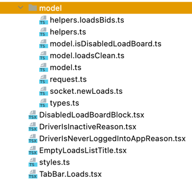

# Features

## Структура
Папка features представляет собой место, где хранится бизнес-логика и основные функции приложения.
Каждая фича служит для группировки компонентов, моделей, хуков, 
хелперов и других элементов, связанных с определенными функциями приложения. 
В папке features следует придерживаться следующих принципов организации:

**Группировка по функциям:** Разделите функции приложения на отдельные папки внутри features. 
Каждая папка должна представлять собой логическую группу компонентов и файлов, связанных с определенной функцией.

```bash
features
-- profile
-- createPost
-- gallery
-- onBoarding
```

**Раздление логики и представления:** Отделяйте логику компонентов от их представления. Если 
Внутри комопнентов (файлы .tsx) должно содержаться как можно меньше логики. Логику необходимо выносить
либо в эффектор модели, либо в хуки. 

```typescript jsx title="src/features/profile/model.ts"
import { createEffect, createEvent, createStore } from 'effector';
import { api } from '../../api';
import { Profile, UpdateProfilePayload } from './types';

// Событие для обновления профиля
export const updateProfile = createEvent<UpdateProfilePayload>();

// Эффект для загрузки профиля с сервера
export const fetchProfileFx = createEffect(async (userId: string) => {
  const response = await api.get<Profile>(`/profiles/${userId}`);
  return response.data;
});

// Эффект для сохранения обновленного профиля на сервере
export const saveProfileFx = createEffect(async (payload: UpdateProfilePayload) => {
  const response = await api.put<Profile>(`/profiles/${payload.userId}`, payload);
  return response.data;
});


// Стор для хранения профиля
export const $profile = createStore<Profile | null>(null)
  .on(fetchProfileFx.doneData, (_, profile) => profile)
  .on(saveProfileFx.doneData, (_, updatedProfile) => updatedProfile)
  .on(updateProfile, (profile, updatedFields) => {
    if (!profile) return profile;
    return { ...profile, ...updatedFields };
  });

// Обработка ошибок эффектов
fetchProfileFx.fail.watch(({ error }) => {
  console.error('Failed to fetch profile:', error);
});

saveProfileFx.fail.watch(({ error }) => {
  console.error('Failed to save profile:', error);
});

```


```typescript jsx title="src/features/profile/Profile.tsx"
import React, { useEffect } from 'react';
import { useStore } from 'effector-react';
import { useParams } from 'react-router-dom';
import { $profile, fetchProfileFx } from './model';
import { Profile } from './types';

export const Profile = () => {
  const { userId } = useParams<{ userId: string }>();
  const profile = useStore($profile);

  useEffect(() => {
    fetchProfileFx(userId);
  }, [userId]);

  if (!profile) return null;

  return (
    <View>
      <Text>{profile.name}</Text>
      <Text>{profile.bio}</Text>
    </div>
  );
};
```

<details>
  <summary>Сложный пример</summary>

Основной файл фичи:
```typescript jsx title="src/features/events/EventsList.tsx"
import React, { useEffect } from "react";
import ScreenList from "../lists/ScreenList";
import { eventsListModel } from "./model";


const EventsList = () => {
  useEffect(() => {
    eventsListModel.init();
  });

  return (
    <ScreenList
      categories={categories}
      model={eventsListModel}
      Item={EventCard}
      detailsLink={Links.EVENT_DETAILS}
      keyExtractor={idExtractor}
    />
  );
};
```

Файл модели:

```typescript jsx title="src/features/events/model.ts"
import { createPaginatedListModel } from "../../lib/models/pagination";
import api from "../../api";

export const eventsListModel = createPaginatedListModel({
  request: api.events.get,
  itemExtractor: (response) => response.events,
  nextPageFilter: ({ page, total, response }) => {
    if (response.events_count < total) return page + 1;
    return null;
  },
});
```
Довольно просто?<br/>
Тут используется модель eventsListModel, которая хранит всю логику для работы со списком и компонент ScreenList 
который принимает логику целеком и знает как с ней работать. 
Трюк заключается в том, что можно создавать не только переиспользуеме компоненты но и целые модели, 
например для листов с пагинацией или для форм

**Реализация ScreenList:**
```typescript jsx title="src/features/lists/ScreenList.tsx"

export type ScreenListProps<T, L extends Links, P extends void | any> = {
  model: PaginatedListModel<T, any, P>;
  Item: ComponentType<ScreenListItemProps<T>>
  detailsLink: ScreensProps[L] extends { item: T; index?: number } ? L : never;
  keyExtractor: (item: T, index: number) => string;
  categories: SelectItem[];
};

const ScreenList = <T, L extends Links, P extends void | any>({
  categories,
  model,
  Item,
  detailsLink,
  keyExtractor,
}: ScreenListProps<T, L, P>) => {
  const navigate = useNavigate();
  const list = usePaginatedListModel(model);

  const goToDetails = useCallback((item: T, index: number) => {
    navigate(detailsLink, { item, index });
  }, []);

  const renderItem: ListRenderItem<T> = useCallback(
    ({ item, index }) => {
      return (
        <Item
          index={index}
          item={item}
          onPress={goToDetails}
          style={categorisedListStyles.card}
        />
      );
    },
    [Item, goToDetails]
  );

  return (
    <CategorisedList
      keyExtractor={keyExtractor}
      refreshing={list.isRefreshing}
      categories={categories}
      data={list.items}
      renderItem={renderItem}
      onRefresh={model.refreshSync}
      onEndReached={model.getNextSync}
    />
  );
};

```

**Реализация PaginatedListModel:**
```typescript jsx title="src/features/lib/models/padinatedListModel/model.ts"
import { attach, createEffect, createEvent, restore, sample } from "effector";

export class PaginatedListModel<T, R, P> {
  private readonly request;
  private readonly itemExtractor;
  private readonly nextPageGetter;
  private readonly nextPage = createStateModel<number | null>(1);
  private readonly defaultProps;

  public readonly init = createEvent<P>();

  public constructor({
    request,
    itemExtractor,
    nextPageFilter,
    defaultProps,
  }: PaginatedListModelProps<T, R, P>) {
    this.defaultProps = defaultProps;
    this.request = request;
    this.itemExtractor = itemExtractor;
    this.nextPageGetter = nextPageFilter;

    this.get.done.watch(this.resetListWith);
    this.refresh.done.watch(this.resetListWith);

    sample({
      source: this.$items,
      clock: this.getNextPageFx.done,
      fn: (items, { result, params }) => {
        if (!result || !params.page) return;
        const newItems = this.itemExtractor(result);
        return {
          newItems,
          total: newItems.length + items.length,
          page: params.page,
          response: result,
        };
      },
    }).watch((props) => {
      if (!props) return;
      const { newItems, ...nextPageProps } = props;
      this.addItems(newItems);
      const nextPage = this.nextPageGetter(nextPageProps);
      this.nextPage.set(nextPage);
    });

    sample({
      source: this.$items,
      clock: this.init,
      filter: (items) => !items.length,
      fn: (_, props) => props,
    }).watch(this.getSync);
  }

  private readonly resetListWith = ({ result }: { result: R }) => {
    const items = this.itemExtractor(result);
    this.setItems(items);
    const nextPage = this.nextPageGetter({
      total: items.length,
      response: result,
      page: 1,
    });
    this.nextPage.set(nextPage);
  };

  public readonly get = createEffect((props: P) => {
    return this.request({
      ...props,
      page: 1,
    });
  });
  public readonly $isLoading = this.get.pending;
  public readonly getSync = (props: P) => {
    this.get(props).catch(noop);
  };

  private getNextPageFx = createEffect(
    ({ page, isLoading }: GetNextFxProps<P>) => {
      if (!page || page === 1 || isLoading) return null;
      return this.request({
        ...this.defaultProps!,
        page,
      });
    }
  );
  public readonly $isNextLoading = this.getNextPageFx.pending;

  public readonly getNext = attach({
    source: {
      page: this.nextPage.$state,
      isLoading: this.$isNextLoading,
    },
    mapParams: (_: void, { page, isLoading }) => ({ page, isLoading }),
    effect: this.getNextPageFx,
  });
  public readonly getNextSync = () => {
    this.getNext().catch(noop);
  };

  public readonly refresh = createEffect(() => {
    return this.get(this.defaultProps!);
  });
  public readonly $isRefreshing = this.refresh.pending;
  public readonly refreshSync = () => {
    this.refresh().catch(noop);
  };

  public readonly setItems = createEvent<T[]>();
  public readonly addItems = createEvent<T[]>();
  public readonly $items = restore<T[]>(this.setItems, []).on(
    this.addItems,
    (state, payload) => [...state, ...payload]
  );

  public readonly reset = () => {
    this.nextPage.reset();
    this.setItems([]);
  };
}

export const createPaginatedListModel = <T, R, P>(
  props: PaginatedListModelProps<T, R, P>
) => {
  return new PaginatedListModel(props);
};

```

**Реализация usePaginatedListModel:**
```typescript title="src/features/lib/models/padinatedListModel/hooks.ts"
import { useStore } from "effector-react";
import { PaginatedListModel } from "./model";

export function usePaginatedListModel<T, R, P>(
  model: PaginatedListModel<T, R, P>
) {
  const isRefreshing = useStore(model.$isRefreshing);
  const isLoading = useStore(model.$isLoading);
  const isNextLoading = useStore(model.$isNextLoading);
  const items = useStore(model.$items);

  return { items, isLoading, isNextLoading, isRefreshing };
}

```

</details>

## Разделение файлов
В случае, когда одна фича имеет несколько различных аспектов или подфункций или если файл модели становиться
слишком большим, вы можете разделить его на несколько файлов. Например, вы можете создать файлы моделей для
каждого аспекта фичи. Например, если у вас есть фича управления пользователями, вы можете создать файлы
моделей для управления пользователями и управления разрешениями.

В случае разделения моделей, в название файла добавляетя префикс `model.`. 

<details>
<summary>Пример</summary>

**Структура папки
```text title="src/features/users"
features
  -- userManagement
    --- UserList.tsx
    --- PermissionList.tsx
    --- model.ts
    --- model.permissions.ts
```

**Реализация модели:**
```typescript jsx title="src/features/users/model.ts"
import { createEffect, createEvent, createStore } from 'effector';
import { api } from '../../api';
import { User } from './types';

export const fetchUsersFx = createEffect(async () => {
  const response = await api.get<User[]>(`/users`);
  return response.data;
});

fetchUsersFx.fail.watch(({ error }) => {
  console.error('Failed to fetch users:', error);
});

export const $users = createStore<User[]>([])
    .on(fetchUsersFx.doneData, (_, users) => users);

```

**Реализация модели для управления разрешениями:**
```typescript jsx title="src/features/users/model.permissions.ts"
import { createEffect, createEvent, createStore } from 'effector';
import { api } from '../../api';
import { Permission } from './types';

export const fetchPermissionsFx = createEffect(async () => {
  const response = await api.get<Permission[]>(`/permissions`);
  return response.data;
});

fetchPermissionsFx.fail.watch(({ error }) => {
  console.error('Failed to fetch permissions:', error);
});

export const $permissions = createStore<Permission[]>([]);
    .on(fetchPermissionsFx.doneData, (_, permissions) => permissions);
```

</details>

<details>
<summary>Сложный пример</summary>

**Структура папки**
```text title="src/features/singUp"

 singUp
 ├── country
 │   ├── model.ts
 │   └── CountriesList.tsx
 ├── phone
 │   ├── model.ts 
 │   └── PhoneInput.tsx
 ├── userData
 │   ├── model.ts
 │   └── UserDataForm.tsx
 ├── model.ts
 ├── model.password.tsx
 └── request.ts

```

**Модели**
```typescript jsx title="src/features/singUp/country/model.ts"
 export const signUpCountryModel = createStateModel<Country | null>(
  DEFAULT_COUNTRY
 )
```
```typescript jsx title="src/features/singUp/phone/model.ts"
 export const signUpPhoneModel = createPhoneEnterModel()

 sample({
   clock: signUpCountryModel.$state,
   source: signUpPhoneModel.$phoneNumber,
   fn: (phone, country) => ({ phone, country }),
 }).watch(({ phone, country }) => {
   if (phone) return
   signUpPhoneModel.setCountry(country)
 })
```
```typescript jsx title="src/features/singUp/userData/model.ts"
 export const signUpUserDataFormSchema: ObjectSchema<SignUpUserDataForm> = yup
  .object()
  .shape({
    name: stringSchema().trim().min(1),
    lastName: stringSchema().trim().min(1),
    birthDate: yup.date().default(INITIAL_DATE).max(new Date()).required(),
    email: stringSchema().email(),
  })
 export const signUpUserDataFormModel = createFormModel(signUpUserDataFormSchema)
```
```typescript jsx title="src/features/singUp/model.passwords.ts"
 const signUpPasswordsFormSchema = passwordsFormSchema.concat(
  yup.object({
    userAgreement: yup.boolean().default(false).required(),
  })
)

 export const signUpPasswordsFormModel = createFormModel(
   signUpPasswordsFormSchema
 )

```
```typescript jsx title="src/features/singUp/model.passwords.ts"
 export const $signUpFormData = combine({
  user: signUpUserDataFormModel.$store,
  phone: signUpPhoneModel.$phoneNumber,
  country: signUpCountryModel.$state,
  passwords: signUpPasswordsFormModel.$store,
 })

 export const resetSignUpFormData = () => {
   signUpUserDataFormModel.reset()
   signUpPhoneModel.reset()
   signUpCountryModel.reset()
   signUpPasswordsFormModel.reset()
 }

 export type SignUpFormData = {
   user: SignUpUserDataForm
   country: Country | null
   phone: string
   passwords: PasswordsFormModel
 }
```

**Запрос**
```typescript jsx title="src/features/singUp/request.ts"
 export const signUp = attach({
  source: $signUpFormData,
  mapParams: (_: void, props) => ({
    ...convertSignUpFormToSignUpBody(props),
    is_manager: false,
    is_superuser: false,
  }),
  effect: api.users.signUp,
 })

 export const signUpErrorModel = createStateModel<null | string>(null)
 
 signUp.done.watch(({ result }) => {
   resetSignUpFormData()
   apiManager.token.set(tokenResponseToTokens(result.tokens))
   const myNewProfile = signUpUserResponseToNewUser(result.user)
   setMyProfile(myNewProfile)
   signUpErrorModel.reset()
 })
 
 signUp.fail.watch(({ error }) => {
   const errorDetails = (error as ApiError).data?.detail
   if (!errorDetails) return
   if (Array.isArray(errorDetails)) {
     signUpErrorModel.set(errorDetails.map(({ msg }) => msg).join(', '))
     return
   }
   signUpErrorModel.set(errorDetails)
 })
```

</details>

### По папкам
Если файлов модели становится слишком много (в том числе вспомогательных файлов), их можно вынести в отдельную папку models<br/>


## Вспомогательные файлы
В некоторых случаях вы можете создать вспомогательные файлы для упрощения работы с моделями и компонентами. Это могут
быть файлы types, helpers, utils, constants и пр. Так же как и с моделями, внутри одной фичи может находится несколько
однотипных файлов, в название которых добавляется префикс. Очень важно чтобы ВСЕ файлы относящиеся к данной фиче
находились в одной папке.

### helpers
Файлы helpers содержат вспомогательные функции, которые используются для работы с фичей. Например функции для
обработки данных, которые приходят с бэка, функции для преобразования данных в формат, который ожидает бэк, функции
для валидации данных и пр. Не стоит помещать в helpers функции в которых реализована непосредствнно бизнес логика
приложения. Такие функции должны находится в моделях. 

<details>
<summary>Пример</summary>

**Структура папки
```text title="src/features/orderManagement"
features
  -- orderManagement
    --- OrderList.tsx
    --- DeliveryList.tsx
    --- model.ts
    --- helpers.ts
    --- helpers.delivery.ts
```

```typescript jsx title="src/features/orderManagement/helpers.ts"
export function calculateTotal(orderItems: OrderItem[]): number {
  return orderItems.reduce((acc, item) => acc + item.price * item.quantity, 0);
}

export function getOrderStatus(order: Order): string {
  if (order.isCanceled) {
    return 'Отменен';
  }
  if (order.isDelivered) {
    return 'Доставлен';
  }
  return 'В обработке';
}
```

```typescript jsx title="src/features/orderManagement/helpers.delivery.ts"
export function getDeliveryStatus(delivery: Delivery): string {
  if (delivery.isCompleted) {
    return 'Завершена';
  }
  if (delivery.isInProgress) {
    return 'В процессе';
  }
  return 'Ожидает начала';
}

export function calculateDeliveryTime(delivery: Delivery): number {
  const startTime = new Date(delivery.startTime).getTime();
  const endTime = new Date(delivery.endTime).getTime();
  return (endTime - startTime) / (60 * 60 * 1000);
}
```

</details>

### request
<details>
<summary>Пример</summary>

```typescript jsx title="request.ts"
import { createEffect } from 'effector';
import axios from 'axios';
import { Article, NewArticle } from './types';

const API_URL = '/api/articles';

export const getArticlesFx = createEffect(async (): Promise<Article[]> => {
  const response = await axios.get<Article[]>(API_URL);
  return response.data;
});

export const getArticleFx = createEffect(async (id: number): Promise<Article> => {
  const response = await axios.get<Article>(`${API_URL}/${id}`);
  return response.data;
});

export const createArticleFx = createEffect(async (newArticle: NewArticle): Promise<Article> => {
  const response = await axios.post<Article>(API_URL, newArticle);
  return response.data;
});

export const updateArticleFx = createEffect(async (payload: { id: number; updatedArticle: Partial<Article> }): Promise<Article> => {
  const { id, updatedArticle } = payload;
  const response = await axios.put<Article>(`${API_URL}/${id}`, updatedArticle);
  return response.data;
});

export const deleteArticleFx = createEffect(async (id: number): Promise<void> => {
  await axios.delete(`${API_URL}/${id}`);
});
```

</details>

<details>
<summary>Реальный пример</summary>

```typescript jsx title="request.ts"
const setLoadsRequestNextUrl = createEvent<string | null>()
const $loadsNextUrl = restore(setLoadsRequestNextUrl, null)

export const $loadRequestParams = combine({
  filters: $filtersList,
  vehicle: activeVehicleModel.$state,
  location: $activeVehicleLocation,
}).map<null | LoadsListRequestProps>(({ filters, vehicle, location }) => {
  if (!vehicle || !filters || !filters[vehicle.id]) return null
  return {
    vehicle: vehicle.id,
    filtersUrl: getLoadsUrlParams({
      filters: filters[vehicle.id],
      location: location?.last,
    }),
  }
})

const loadsListRequest = createEffect((url: string) => {
  return request<LoadRequestResponse>({ url, token: true })
})

loadsListRequest.done.watch(({ result }) => {
  setLoadsRequestNextUrl(result.next)
})

export const $isLoadsListOnLoading = loadsListRequest.pending

export const getLoadsList = createEffect((props: LoadsListRequestProps) =>
  loadsListRequest(urls.loads(props))
)

export const getLoadsListNextPage = attach({
  source: $loadsNextUrl,
  mapParams: (_: void, url) => url,
  effect: createEffect((url: string | null) => {
    if (url) return loadsListRequest(url)
  }),
})

export const reloadLoadsList = attach({
  source: $loadRequestParams,
  mapParams: (_: void, source) => source,
  effect: createEffect((props: LoadsListRequestProps | null) => {
    if (props) return getLoadsList(props)
  }),
})

```

</details>


### types

<details>
<summary>Пример</summary>

```typescript jsx title="types.ts"
import { Point } from '../../../lib/loads/types'

export enum BidStatus {
  SENDING = 'Sending',
  PENDING_LAST = 'PendingLast',
  RECEIVED_FROM_DISPATCHER = 'ReceivedFromDispatcher',
  ACCEPTED = 'Accepted',
  REJECTED = 'Rejected',
  PENDING = 'Pending',
  MISSED = 'Missed',
  CANCELED = 'Canceled',
  SENDING_ERROR = 'SendingError',
  WON = 'Won',
}

type BidLoad = {
  id: number
  miles: number
  points: Point[]
}

type BidDispatcher = {
  email: string
  first_name: string
  id: number
  last_name: string
}

export type BidHistoryItem = {
  driver: number
  driver_price: number
  feedback_by: BidDispatcher | null
  id: number
  load: BidLoad
  status: BidStatus
  created_date: string
}

export type BidsHistoryResponse = {
  count: number
  next: string | null
  previous: string | null
  results: BidHistoryItem[]
}


```


</details>

Сюда же можно выносить пропсы компонентов, если они используются в нескольких местах.

<details>
<summary>Пример</summary>

```typescript jsx title="types.ts"
import { ReactNode } from 'react'

export type ModalProps = {
  children: ReactNode
  isOpen: boolean
  onClose: () => void
}

```

</details>

### constants

Только константы, который относятся к это фиче. Глобальные константы выносятся в src/constants либо в src/lib/constants.

<details>
<summary>Пример</summary>

```typescript jsx title="types.ts"
import { SCREEN_CONTENT_WIDTH } from '../../../styles/constants'

export const DRAWING_ITEM_MARGIN = 20
export const DRAWINGS_COLUMNS_COUNT = 2

export const DRAWING_ITEM_WIDTH =
  SCREEN_CONTENT_WIDTH / DRAWINGS_COLUMNS_COUNT + DRAWING_ITEM_MARGIN / 2

export const DRAWING_ITEM_HEIGHT = DRAWING_ITEM_WIDTH


```

</details>


:::tip

[Как писать константы](https://google.github.io/styleguide/jsguide.html#naming-constant-names).

:::


### styles
### hooks
